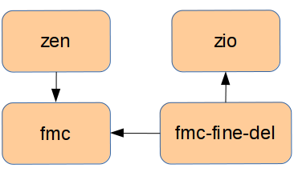

% Fine-Delay support for WR Zen board
% Miguel Jiménez López (<klyone@ugr.es>), University of Granada
% 08 Jul. 2015

Introduction
=========================

In the present document, we explain the `White Rabbit Zen` architecture and its main components to support the Fine Delay FMC card. The Zen board [[@wr-zen]] includes a Zynq [[@xilinx-zynq]]
device so it has both FPGA and ARM microprocesor [[@arm-website]]. 

Project design
============
In this part of the document, we describe the system (gateware and firmware) architecture, including the ARM core and the LatticeMico32 (LM32) [[@lm32-website]] soft-processor.

System architecture
------------
The fig. \ref{fig_zen_gw_arch_overall} shows the overall architecture of the gateware project. This design follows the AMBA specification [[@amba-spec]] and uses the AXI bus. 
The **processing system** (PS) contains the ARM microprocessor that can be conected with several peripherals and the **programable logic** (PL) cores. In our design,
the ARM is connected to the **Zen top** module that is the main IP core. The PS has an input/output interface with the RAM memory (DDR) and with the QPSI EEPROM througth
an AXI crossbar. The first kind of memory is used to store the ARM program (usually a kernel image) and the second one optionally stores a bitstream image to initialize 
the PL device and u-boot parameters. Finally, the ARM core can receive an Interrupt Request (IRQ) from the **Zen top**. This signal is needed by the FD core when the input trigger is used.

\begin{figure}[H]
\centering
\Oldincludegraphics[width=16cm]{img/zen_gw_arch_overall.png}
\caption{Overall gateware design diagram \label{fig_zen_gw_arch_overall}}
\end{figure}

<!---
 {#fig:zen_gw_arch_overall}
 
 [@fig:zen_gw_arch_overall]
-->

### Gateware overview

The gateware design is based on the Fine Delay project but it has two Gigabit Ethernet ports instead of one. Some changes have been necessary in order to
set up and manage the two network interfaces and to save the determinism of the White Rabbit protocol.

\begin{figure}[H]
\centering
\Oldincludegraphics[width=16cm]{img/zen_gw_arch2.png}
\caption{Zen top gateware design diagram \label{fig_zen_gw_arch1}}
\end{figure}

<!---
 {#fig:zen_gw_arch1}

[@fig:zen_gw_arch1]
-->

In the fig. \ref{fig_zen_gw_arch1} we can see the architecture of the **Zen top** in a detailed way. This component is implemented with the Wishbone bus and for this reason,
an AXI-WB Bridge is mandatory to join it with the PS. This IP core is the unique master in the Wishbone bus and it can read/write from/to the other Wishbone slaves connected 
to the main crossbar. The White Rabbit PTP Core (WRPC) is the main module responsible of the implementation of the White Rabbit protocol. The Gigabit Transceiver Ports (GTPs) are 
FPGA primitives that allows the physical communication on a network that follows well-know standards such as Gigabit Ethernet. The Zen board has only an I2C interface, however, we 
need to access to four different logic buses: one for the Zen carrier EEPROM, two for the SFP EEPROMs and the last one for the Fine Delay FMC EEPROM. In order to solve this problem, 
an I2C Arbiter  module has been developped. It is responsible to multiplex several input buses and present an unique output bus. A Fan PWM module is instantiated to control the Fan 
speed using the its Wishbone registers. The Fine Delay core provides all the functionalities needed by the Fine Delay FMC card. It allows to set up different output channels to generate 
pulses or to follow an input trigger with a certain delay. A Vectored Interrupt Controller (VIC) has been added to manage several interrupt sources from Fine Delay core and two Network 
Interface Cores (NICs). Nowadays, we are implementing the NIC support so it is not working yet and has to be completed and tested.

\begin{figure}[H]
\centering
\Oldincludegraphics[width=16cm]{img/wrpc_gw_arch.png}
\caption{WRPC gateware design diagram \label{fig_wrpc_gw_arch1}}
\end{figure}

<!---
 {#fig:wrpc_gw_arch1}

[@fig:wrpc_gw_arch1]
-->

Finally, in the fig. \ref{fig_wrpc_gw_arch1} the WPRC gateware architecture is shown. The structure is the same than the original project in the OHWR except for the inclusion of an
additional Endpoint, MiniNIC and Mux modules for the other network interface.

### LM32 Firmware

The firmware is based on the `wrpc-sw-2.1` of the wrpc-sw repository [[@wrpc-repo]] in the `Open Hardware Repository`. Some changes have been introduced to control two Gigabit Ethernet
Endpoints and others are necessary due to the change of the carrier architecture:

+ The network commands have been modified to work with two ports: *ip*, *sfp*, *mac*, *ptp*, *mode*, etc.

+ The WR-PTP FSM has been duplicated and its methods have been adapted to work with two network interfaces properly.

+ The I2C driver has been updated to configure the I2C switch IC available in the Zen board. An additional command has been coded to set up the switch from the UART/VUART.

+ Now, we can read/write Wishbone registers from the UART/VUART through a new command line tool.

Developments for the Processing System (ARM)
------------------------------------------------

In addition to the configurable part (PL), the Zynq device has an ARM microprocessor that is able to run an embedded Linux operating system. Nowadays, we use a SD image with a 
custom Linux kernel compiled with the Buildroot [[@buildroot-website]] tool, Linux [[@linux-xilinx]] and U-Boot for Xilinx devices [[@uboot-xilinx]]. 
Moreover, we have developped both driver support for the Zen carrier and the Fine Delay FMC and the user-space tools to manage them.

### Linux Drivers

The Zen board needs the following kernel drivers to work properly on the Linux OS:

+ **fmc-bus.ko**: This kernel module allows to register/unregister FMC devices in a single bus on the Linux OS.

+ **zen.ko**: It is the main kernel driver for the Zen board. This initializes the device and provides a memory mapped access 
for all the Wishbone registers.

+ **zio.ko**: This kernel driver uses the sysfs to register/unregister new FMC devices and simplifies the Wishbone register access
through file descriptors on the Linux file system. It is needed by fmc-fine-del.ko.

+ **fmc-fine-del.ko**: It implements all the functionalities for the Fine Delay FMC card.

\begin{figure}[H]
\centering
\Oldincludegraphics[width=6cm]{img/linux_drivers_interactions.png}
\caption{Linux driver dependencies \label{fig_linux_drivers_interactions}}
\end{figure}

<!---
 {#fig:linux_drivers_interactions}

[@fig:linux_drivers_interactions]
-->

In the fig. \ref{fig_linux_drivers_interactions}, we can see the interactions between the different kernel drivers. It is very important not to forget the installation 
order of the different drivers. In the user-space tool some scripts have been included to ease this process.

### User-space Tools

Some tools and scripts are provided to set up and control the working modes of the Zen board.

* **Zen tools**: These try to reproduce the behaviour of the tools available for SPEC-based [[@spec-repo]] design so users can easily adapt their designs to this new platform.

	* **zen-cl**: It allows to program the LM32 firmware quickly and without having to re-synthesize and set up the PL again.
	
	* **zen-fwloader.sh**: This SH script is used to configure the PL device from the Linux OS. 
	
	* **zen-vuart**: It opens a virtual UART connection with the LM32 microprocessor inside of the WRPC. It uses the memory mapped
	access from the **zen.ko** linux kernel.
	
	* **zenmem**: This tool can write/read to/from the PL Wishbone register using the memory mapped access from the **zen.ko** linux
	kernel.
	
* **Fine Delay tools**: These tools have been migrated from the Fine Delay OHWR [[@fine-del-repo]] repository and provide the same functionality as in the Fine Delay project based on SPEC card [[@spec-repo]].

	* **fmc-fdelay-board-time**: This tool allows to get/set the Fine Delay time base. There are several modes to configure it: host (Linux OS time),
	local (free-running) and wr (synchronized with the WRPC).
	
	* **fmc-fdelay-input**: It checks if the trigger input has received any pulse and prints its timestamp.
	
	* **fmc-fdelay-list**: It lists all the Fine Delay FMC devices found in our system.
	
	* **fmc-fdelay-pulse**: It sets up the working mode for each output channel. The main modes are: pulse, delay and disabled.
	
	* **fmc-fdelay-status**: It displays the current state of each output channel.
	
	* **fmc-fdelay-term**: It enables/disables the input resistor of the trigger input channel.
	
* **Installation scripts**: These help to install/remove the kernel drivers for the Zen and Fine Delay FMC boards.

	* **install_zen.sh**: This SH script eases the installation task of the zen.ko and fmc.ko drivers. Moreover, it creates the device file in /dev/zen.
	
	* **install_fdel.sh**: This SH script eases the installation task of the fmc-fine-del.ko, zio.ko, zen.ko,fmc.ko drivers. It uses the install_zen.sh
	if needed.

Project deliverable
===============

In this section we describe the structure of the project deliverable: the SD files and the file system of the Linux OS.

SD files
---------------

The SD files are the following:

* **BOOT.bin**: Boot image for the SD card (contains fsbl.elf + bitstream.bit + u-boot.elf). It is generated using Vivado SDK.

* **devicetree.dtb**: Device Tree binary file for Zen board. Used to boot kernel image. Generated from .dts source file using the *Device Tree Compiler (dtc)*.

* **uImage:** Linux kernel image.

* **uramdisk.image.gz**: Compressed RAM disk with the Linux file system.

Linux file system (RAMFS)
---------------

Linux file system can be modified using the *rootfs_override* feature of the Buildroot tool. It allows to include
some files in certain directories. Our *rootfs_override* set-up is:

* **/root/scripts**: It contains the installation scripts for the Linux kernel drivers.

* **/root/tools:** User-space tools for the zen and fmc-fine-del drivers.

* **/lib/firmware:** Binary files for the gateware and the firmware (LM32).

* **/lib/drivers:** Linux kernel drivers.

Example user cases of the Fine Delay tools
===============================================

The Fine Delay tools have been adapted from the OHWR repository [[@fine-del-repo]] to work in the Zen board. In this section, we
describe a demostration user cases of some of them.

~~~~~~~~~~~~~~{.bash .numberLines}

# Please, remember that you have to install the fmc.ko, zen.ko, zio.ko 
# and fmc-fine-del.ko drivers before using any tool.
# You can use the help script that we provide with the Zen project.

####################################################################
# Fine Delay time base Commands
####################################################################

# Get the Fine Delay time base
fmc-fdelay-board-time get

# Lock with the White Rabbit time base (A WR link is needed)
fmc-fdelay-board-time wr

# Set the Fine Delay time base with the Linux OS time base
fmc-fdelay-board-time host

# Set the Fine Delay time base with a concrete value 
fmc-fdelay-board-time <seconds>:<nanoseconds>

####################################################################
# Fine Delay output channels Commands
####################################################################

# Generate in the first output channel a single pulse 300ns wide, 2 microseconds 
# into the next second
fmc-fdelay-pulse -i 0 -o 1 -m pulse -r 2u -w 300n -c 1 -t -v

# Generate in the second output channel a square signal with a period of 2 microseconds 
# and a high state width of 300ns
fmc-fdelay-pulse -o 2 -w 300n -T 2u

####################################################################
# Fine Delay input trigger Commands
####################################################################

# Enable/Disable the input resistor termination
fmc-fdelay-term <on/off>

# Print each input pulse received
fmc-fdelay-input

# Print the three first pulses received and exit
fmc-fdelay-input -c 3

####################################################################
# Fine Delay status Commands
####################################################################

# List all the Fine Delay FMC cards in the system
fmc-fdelay-list

# List the status of each output channel
fmc-fdelay-status

~~~~~~~~~~~~~~~~~~~~~~~~~~~~~~~~~~

If you need more information about the Fine Delay FMC tools, please visit [[@fine-del-repo]].

Future work 
===============

There are many ongoing works. The most relevant are: 

#. A git repository structure has to be created to store the different projects for the Zen board. 

#. Network Interface Core (NIC) support. The White Rabbit Zen board has two Gigabit Ethernet ports and we want to use them for both synchronization and regular data. 
For this reason, the gateware design must be updated and a Linux device driver must be implemented to see them as network interfaces from the ARM microprocesor.

Annexes
========

Additional tools
--------------------

Some tools for the Linux computer have been developped to program the operating system and the bitstream
of the Zen board remotely:

* **gw_remote_program.sh**: This bash script allows to reprogram the bitstream of the Zen board.

* **linux_remote_program.sh**: It updates the Linux OS of the Zen board and reboot the system. This
tool is designed to replace the ramdisk image inside of the SD card partition. **Take care:** The
u-boot must be configured to load the root file system from ramdisk image instead of an independent
SD partition.

* **set_ssh_keys.sh**: It shares the SSH keys with the Zen board. This allows to execute commands 
with root privileges without many password queries.

Zen SFP Calibration
---------------------

This part has been done with the collaboration of **Felipe Torres** from Seven Solutions company. 

| **Port**     | **SFP**                | **Tx**         | **Rx**         | **alpha**         |
|   :------:   |   :----------------:   |   :--------:   |   :--------:   |   :-----------:   |
|   wr0        |   AXGE-1254-0531       |   123177       |   300763       |   -66989226       |
|   wr0        |   AXGE-3454-0531       |   123407       |   300609       |   66906421        |
|   wr1        |   AXGE-1254-0531       |   123225       |   300897       |   -63325106       |
|   wr1        |   AXGE-3454-0531       |   123229       |   300869       |   65995567        |

Table: SFP calibration parameters {#tbl:sfp-calib-table}

In the [@tbl:sfp-calib-table], we show the main calibration parameters needed by the Zen gateware in order 
to ensure a sub-nanosecond synchronization. You can check more information about the White Rabbit calibration process
in [[@wr-calibration]].

Finally, we describe the commands needed to store the calibration configuration and to initialize the
SFPs.

~~~~~~~~~~~~~~{.bash .numberLines}
# Write the SFP configuration in the EEPROM
sfp add AXGE-1254-0531 wr0 123177 300763 -66989226
sfp add AXGE-3454-0531 wr0 123407 300609 66906421
sfp add AXGE-1254-0531 wr1 123225 300897 -63325106
sfp add AXGE-3454-0531 wr1 123229 300869 65995567

# Update the init script for the boot time
init add sfp detect
init add sfp match
init add mode slave_port1
init add ptp start
~~~~~~~~~~~~~~~~

Zen SPI Boot configuration
---------------------------

The Zen board file system boots from ramdisk located at first partition on the SD card by default. If you want to run a file system
from another SD partition, you have to configure the u-boot parameters and store them in the SPI memory.

The first step is to format the SD card with two different partitions (You can use a linux tool such as gparted for this operation):

#. **Boot partition:** It must be a FAT32 partition, have a size of 200 MB at least, be booteable and have the lba flag enabled. 
 
#. **Rootfs partition:** It must be formatted with a linux compatible partition such as ext4. 

The second step consists in copying files to these two partitions. In the boot one you have to store the BOOT.bin, the Linux image (uImage) and the 
devicetree.dtb binaries. On the other hand, in the rootfs partition you have to save the root file system uncompressed.

Finally, you must boot the Zen board and configure the u-boot parameters.

> Note: when the Zen board starts to run, press any key to stop the default boot mode and to enter in the u-boot terminal mode.

~~~~~~~~~~~~~~{.bash .numberLines}
# Boot from a SD partition

setenv bootargs "console=ttyPS0,115200 root=/dev/mmcblk0p2 rw rootfstype=ext4 rootwait \ 
earlyprintk"
setenv sdboot "if mmcinfo; then run uenvboot; echo Copying Linux from SD to RAM... && \
load mmc 0 ${kernel_load_address} ${kernel_image} \ 
&& load mmc 0 ${devicetree_load_address} ${devicetree_image} \
&& bootm ${kernel_load_address} - ${devicetree_load_address} ${bootargs}; fi" 
saveenv

# Default configuration (ramdisk image)

setenv bootargs "console=ttyPS0,115200 root=/dev/ram rw"
setenv sdboot "if mmcinfo; then run uenvboot; echo Copying Linux from SD to RAM... && \
load mmc 0 ${kernel_load_address} ${kernel_image} && \
load mmc 0 ${devicetree_load_address} ${devicetree_image} && \
load mmc 0 ${ramdisk_load_address} ${ramdisk_image} && \
bootm ${kernel_load_address} ${ramdisk_load_address} ${devicetree_load_address}; fi"
saveenv
~~~~~~~~~~~~~~~~

References
============
